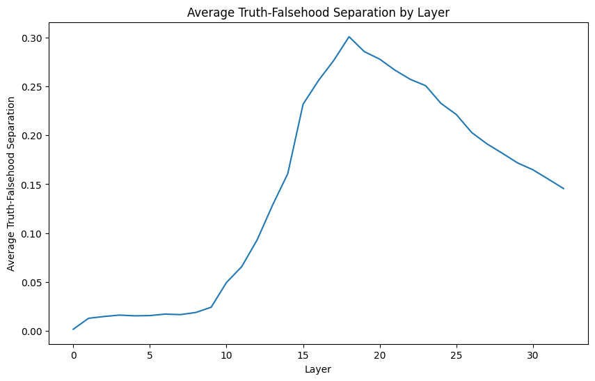
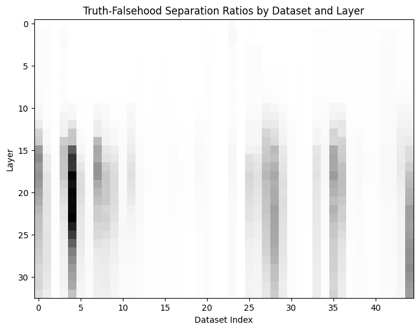

# Summary

In this project, I reproduced some of the main results of the paper 
["Truth is Universal" paper (Bürger et al.)](https://arxiv.org/abs/2407.12831v2) for 
[Phi-3.5-mini](https://huggingface.co/microsoft/Phi-3.5-mini-instruct).
In [v1](https://github.com/BareBeaverBat/TruthIsUniversalInPhi3_5/tree/v1) of the project, I completed that reproduction 
without looking at the source code for Bürger et al.'s paper until it was time to write this report.  
After looking at their source code and doing a retrospective, I updated the code, reran the experiments, and updated
the analysis as well as this report.

I  
1. harvested residual stream activations after all layers for the last token of each statement in Bürger et al.'s 
datasets
2. analyzed truth-falsehood separation in those activations by layer across all datasets and picked 1 layer to focus on
3. simultaneously learned truth and polarity directions in the vector spaces of activations after that layer.
4. trained TTPD probes that used those directions and evaluated their performance on unseen datasets
5. trained linear probes as a baseline (mimicking the linear probes of 
[Marks & Tegmark](https://arxiv.org/abs/2310.06824), which Bürger et al. had used as one of their baselines) and 
compared their performance to the TTPD probes

This report has been updated as part of the second iteration of the project, eliminating obsolete details (e.g. about 
mistakes in the first version of the project and about ideas that didn't pan out). All of those details can be found in
the [v1 report](https://github.com/BareBeaverBat/TruthIsUniversalInPhi3_5/blob/v1/Report.md).

## Findings

1. Truth probes of Phi-3.5-mini's activations did markedly worse than probes of relatively larger (7B or 8B parameters) 
LLMs' activations on topics involving a lot of memorized-trivia/world-knowledge.
   1. Phi-3.5-mini only has 3.8B parameters. In fact, the [Phi-3 Technical Report](https://arxiv.org/abs/2404.14219) (in 
   section 6- Weakness) called out this problem (that the phi-3-mini model, with the same number of weights as 
   phi-3.5-mini, doesn't have as much capacity for storing 'factual knowledge' as models with 2x or more parameters)  
2. Simple linear probes did better than TTPD probes for Phi-3.5-mini (as trained by this project), by ~10pp (percentage 
points) on train-set accuracy, ~7-8pp on validation accuracy, and ~1pp on test accuracy.
3. The 'separation' between true and false statements for a given dataset correlates fairly strongly (0.67-0.69) with 
train and validation accuracy of TTPD probes trained on that activation data.   
   - Bürger et al.'s definition of that separation metric: "Ratio of the between-class variance and within-class 
variance of activations corresponding to true and false statements, ... averaged over all dimensions of the ... layer"
   - When a training scenario included multiple dataset files, the separation metric for the scenario's data was 
calculated as the arithmetic mean of those datasets' separation metric values (weighted by the datasets' record counts).
   - It might be used to identify when a model's activations (at the current location of extraction) are not clearly/ 
accurately modelling the truth/ falsehood of a given population of statements (without having to spend compute to train 
and evaluate probes on that data).
   - However, for TTPD probes validation accuracy correlated very weakly with test accuracy (~0.06) and this separation
metric actually appeared to have a weak _negative_ (-0.09) correlation with test accuracy. This may need further study.

## Updates from v1 to v2

- I used a bias term in the linear probes and the TTPD probes in the second iteration of the project, following Bürger 
et al. Meanwhile, in v1 I hadn't used a bias term in the probes, based on checking Marks & Tegmark's source code for 
linear probes to ensure that I was accurately representing their design.
- I fixed a mistake in the TTPD probe implementation which made them harder to train and less efficient to train/ store/ 
use
  - result of overly-literally interpreting a passage in the paper about 'projecting' a vector __u__ onto a vector __v__
- I followed Bürger et al.'s implementation in discarding the polarity direction that was learned with the truth 
direction and subsequently learning a polarity direction through linear regression on activations and polarity labels.  
- I used a (far more efficient) closed-form solution for learning truth and polarity directions.
- I trained 20 directions/probes for each training scenario, which allowed me to calculate confidence intervals for 
various evaluation statistics in the analysis Jupyter notebook (using Student's t-distribution).
- Small dataset files were not used as training scenarios.
- The "affirmative statements plus disjunctive statements from one topic" type of multi-file scenario was changed to
"negated statements plus disjunctive statements from one topic" so that as many scenarios as possible would include a 
mix of positive- and negative- polarity statements.
- I stopped doing anything with layer 25 activations because TTPD probes based on them ~universally and dramatically 
underperformed TTPD probes based on layer 18 activations in v1 results analysis.

I also refactored/simplified a number of things in the code, e.g. replacing a lot of assert clutter with a combination 
of jaxtyping annotations and the beartype library.

# Table of Contents
1. [Truth-Falsehood Separation by Layer](#truth-falsehood-separation-by-layer)
2. [Truth-Polarity Directions](#truth-polarity-directions)
3. [TTPD Probes Results](#ttpd-probes-results)
4. [TTPD vs Linear Probes](#ttpd-vs-linear-probes)

# Truth-Falsehood Separation by Layer
As Bürger et al. found, there was one layer which was clearly overall best for truth-falsehood separation (18 in the 
case of Phi-3.5-mini).  

However, I did the truth-falsehood separation analysis on all datasets rather than just 4, and I found that the 
greatest separation was found after later layers (22-29) for a small minority of datasets.  

Based on this (and results from v1 of the project), I chose to only focus on layer 18 (the global peak) for learning 
truth and polarity directions (and the TTPD and baseline-linear probes).

# Truth-Polarity Directions

In v2 of the project, the truth and polarity directions are derived jointly using a closed-form solution to an ordinary 
least squares framing of the problem of reconstructing activations from a mean activation vector plus the truth and 
polarity labels for each activation vector. The actually-used polarity direction is then learned using linear regression 
on the activation vectors and the polarity labels.

I evaluated the quality of a given scenario's truth and polarity directions on their own by computing the reconstruction
loss for that scenario's training data with just the mean vector of that data and seeing what percentage of that 
reconstruction loss was eliminated by introducing the learned truth/polarity directions and that data's truth/polarity 
labels. I also evaluated how well the directions generalized to the validation-split data for the same scenario in a 
similar manner; this included contrasting the reconstruction loss reduction in the validation data when the mean vector
had been calculated from the training data vs when the mean vector had been calculated from the validation data.

The directions generalized extremely well. The reconstruction quality metric on the train-set data (which was used to 
derive the directions) had a 0.999+ Pearson correlation coefficient with the reconstruction quality metric on the 
validation-set data (regardless of whether the mean activation vector was being calculated from train-set or 
validation-set data).

The truth-falsehood separation ratio for a given scenario was pretty strongly correlated with the above metrics for 
evaluating learned truth and polarity directions, albeit less strongly than it was correlated with probe accuracy. 
The Pearson correlation coefficient with the truth-falsehood separation ratio was ~0.59 for layer 18 activations for 
each of the directions' reconstruction loss metrics.

# TTPD Probes Results

2-tuples of numbers in the following sections are 95% confidence intervals calculated using Student's t-distribution 
(though without accounting for multiple comparisons).

## Variation in TTPD performance by category/topic

Bürger et al. focused on models with 7B to 27B parameters (primarily studying Llama 3 8B) while this project tried to 
reproduce their results on a markedly smaller model (Phi-3.5-mini has 3.82B parameters).  
As a result, it is perhaps unsurprising that the TTPD probes in this project struggled much more than the Llama 3 8B
probes did on topics like facts and inventors (which required the model pretraining to have memorized relatively more 
obscure pieces of trivia or world knowledge), even just in terms of validation accuracy. 

| Scenario type       | Scenario                         | Validation accuracy |
|---------------------|----------------------------------|---------------------|
| single file         | relative-comparison larger than  | (0.984, 0.990)      |
| single file         | relative-comparison smaller than | (0.992, 0.995)      |
| single file         | true-false common claim          | (0.743, 0.756)      |
| single file         | true-false counterfactual        | (0.710, 0.715)      |
| 4 variants in topic | animal class                     | (0.724, 0.749)      |
| 4 variants in topic | city name to country name        | (0.882, 0.890)      |
| 4 variants in topic | element symbols                  | (0.774, 0.813)      |
| 4 variants in topic | facts                            | (0.736, 0.757)      |
| 4 variants in topic | inventors                        | (0.597, 0.618)      |
| 4 variants in topic | Spanish-English translation      | (0.830, 0.844)      |

We can also look at the average generalization accuracy for each category/topic (how well a probe performed on 
never-seen-in-training dataset files in a given category/topic, averaged across all probes):

| Target category/topic       | Generalization accuracy (averaged over TTPD probes) |
|-----------------------------|-----------------------------------------------------|
| relative comparison         | (0.732, 0.753)                                      |
| true-false                  | (0.648, 0.656)                                      |
| animal class                | (0.698, 0.711)                                      |
| cities                      | (0.810, 0.824)                                      |
| element symbols             | (0.703, 0.712)                                      |
| facts                       | (0.661, 0.668)                                      |
| inventors                   | (0.629, 0.635)                                      |
| Spanish-English translation | (0.745, 0.757)                                      |
| real world scenarios        | (0.754, 0.768)                                      |

It seems as though the activations of Phi-3.5-mini have unusually clear representations of the truth/ falsehood of 
statements about city-name/ country-name pairs. Not only does a TTPD probe trained on such statements generalize very 
well to unseen statements of the same type, but also well-generalizing probes will on average do markedly better on 
unseen 'cities' datasets than on other types of unseen datasets.

It's slightly curious that Phi-3.5-mini knows trivia about city-name/country-name pairs far better than other kinds of 
trivia/ world-knowledge (perhaps they came up in the training data for multilingual capabilities).

## Variation in TTPD generalization performance by data variant

Here is the average generalization accuracy of TTPD probes on unseen datasets that are particular 'data variants'.

| Target data variant | Generalization accuracy (averaged over TTPD probes) |
|---------------------|-----------------------------------------------------|
| English affirmative | (0.840, 0.861)                                      |
| English negated     | (0.804, 0.824)                                      |
| Conjunctive         | (0.739, 0.756)                                      |
| Disjunctive         | (0.551, 0.559)                                      |
| German affirmative  | (0.759, 0.771)                                      |
| German negated      | (0.717, 0.732)                                      |

As you can see, TTPD probes generalize to simple English-language affirmative or negated statements pretty well, 
English-language conjunctive or German-language affirmative/negated statements a little less well, and English-language
disjunctive statements absolutely terribly.

Now let's consider from the other side - grouping together probes that were only trained on a selection of 2 or 4 data
variants (from some single topic) and seeing what their average generalization accuracy was (i.e. calculating such a 
probe's average accuracy across _all_ datasets that it wasn't trained on, then averaging this result across all such
probes that were trained on different topics but the same selection of data variants).

| Training data variants                             | Average generalization accuracy |
|----------------------------------------------------|---------------------------------|
| Affirmative and negated                            | (0.685, 0.701)                  |
| Negated and conjunctive                            | (0.682, 0.699)                  |
| Negated and disjunctive                            | (0.620, 0.643)                  |
| Affirmative, negated, conjunctive, and disjunctive | (0.677, 0.688)                  |

Training on disjunctive statements' activations rather than those of conjunctive or affirmative statements is clearly
less conducive to learning generalizable truth directions, again suggesting that there are not especially clear linear
representations of disjunctive statements' overall truth/ falsehood (at least at the chosen layer on the punctuation 
token that ends the statement).

## Generalization within vs across topics

TTPD probes that had been trained on some variants of one or more known topics generalized to unseen data variants in 
the known topic(s) (test accuracy (0.727,0.743)) only very slightly better than they generalized to unseen data variants 
in novel topics (test accuracy (0.713,0.725)).

# TTPD vs Linear Probes

While Bürger et al. also implemented Contrast-Consistent Search and Mass Mean probes as baselines, I only implemented the linear probes from [Marks & Tegmark](https://arxiv.org/abs/2310.06824) as a baseline because of limited time.

The baseline linear probes had higher validation (within topic/variant) accuracy than the TTPD probes that I trained for 
Phi-3.5-mini (by 7-8 pp on average).

Also, the baseline linear probes had higher test-set accuracy (averaged over all datasets that were completely unseen in training) than the TTPD probes that I trained for Phi-3.5-mini (by ~0.7-1.4 pp on average).

Intriguingly, while TTPD probes had slightly worse average generalization accuracy than LR probes on datasets of unseen variants in already-seen topics, TTPD probes had a very slightly better average generalization accuracy on datasets of unseen variants in novel topics.

I've also aggregated TTPD-LR comparisons based on the category which an unseen dataset belonged to and based on 
which data variant (within a 6-way topic) an unseen dataset belonged to:

| Target category             | TTPD - LR difference in test-set accuracy (averaged over training scenarios) |
|-----------------------------|------------------------------------------------------------------------------|
| relative comparison         | (-0.0105, 0.0139)                                                            |
| true-false                  | (-0.0151, -0.00784)                                                          |
| animal class                | (-0.0245, -0.0103)                                                           |
| cities                      | (0.00855, 0.0247)                                                            |
| element symbols             | (-0.0414, -0.0295)                                                           |
| facts                       | (-0.0120, -0.00408)                                                          |
| inventors                   | (-0.0309, -0.0218)                                                           |
| Spanish-English translation | (-0.0325, -0.0200)                                                           |
| real world scenarios        | (0.0288,  0.0490)                                                            |

| Target data variant | TTPD - LR difference in test-set accuracy (averaged over training scenarios) |
|---------------------|------------------------------------------------------------------------------|
| English affirmative | (0.00434,  0.0201)                                                           |
| English negated     | (0.00713,  0.0236)                                                           |
| Conjunctive         | (-0.0328,  -0.0127)                                                          |
| Disjunctive         | (-0.0505,  -0.0388)                                                          |
| German affirmative  | (-0.0147,  -0.00489)                                                         |
| German negated      | (0.000465, 0.0105)                                                           |

There are not particularly clear patterns here, but this does show a mixed picture where the LR probes didn't generalize 
better than TTPD probes on all types of data.

Further details on the different TTPD and LR probes' performance (both in terms of training/validation accuracy and in terms of 
generalization) can be found in [this notebook](analyzing_overall_results.ipynb)

